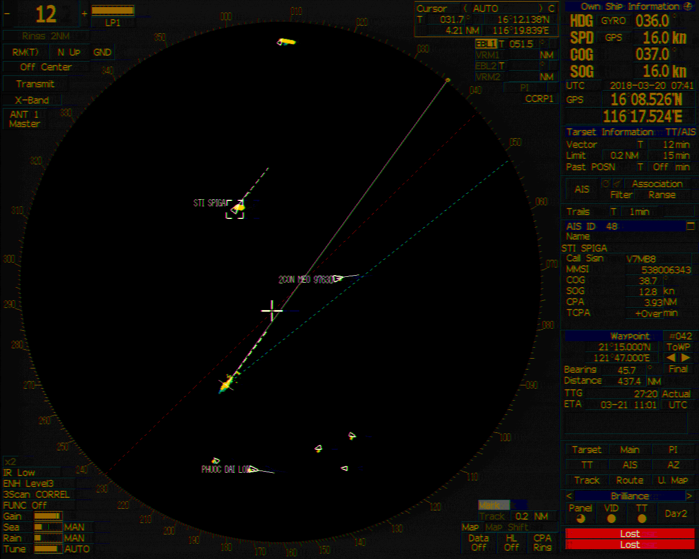
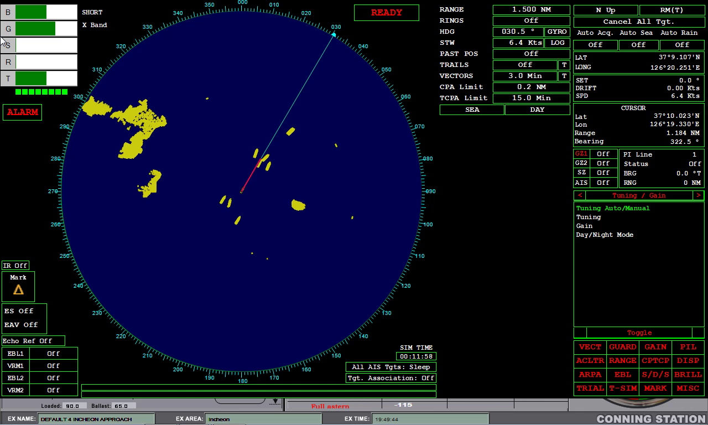
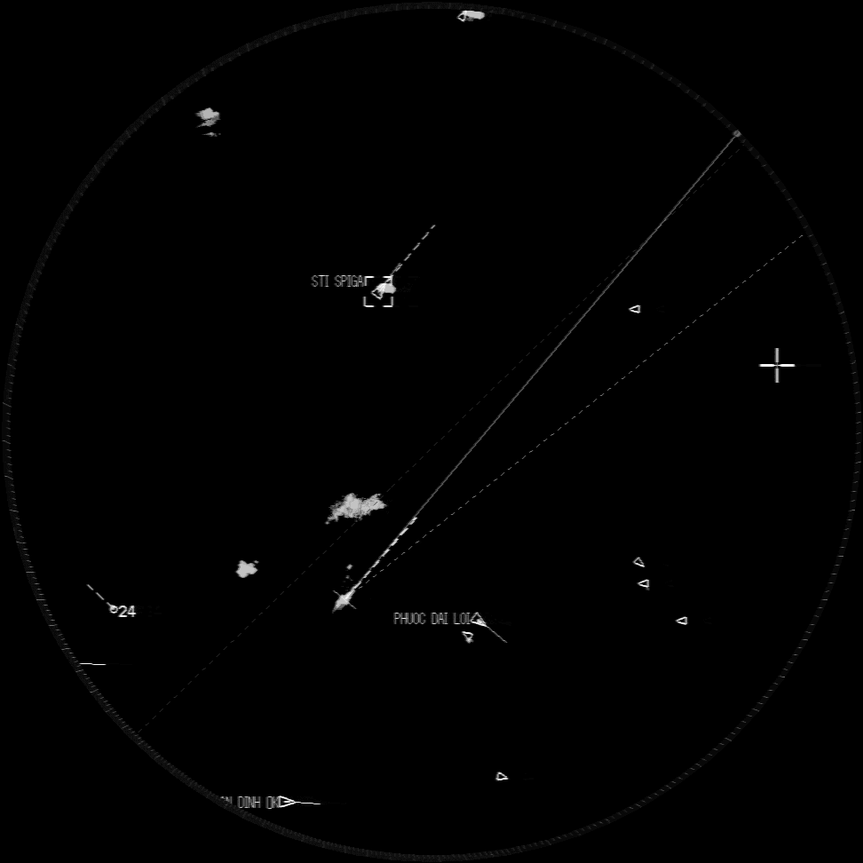
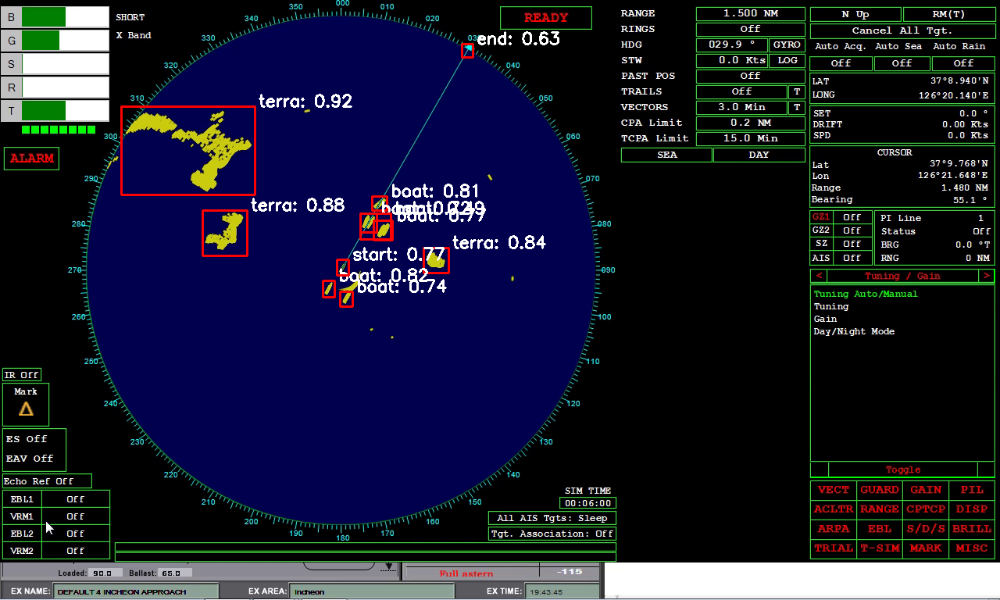

# Radar object detect

## Data
### Radar type1

### Radar type2


```
As you can see,they look similar, but actually they are quite different except circle part, where the detect objects.
```
---
## Label tools
used [labelme](https://github.com/wkentaro/labelme) for annotation.

---
## Method
At first, I tried to train the data without some process. However the model did not train well.  
So I tried to extract common feature of those, the circle.

  

Got circle using Hough circle transform algorithm. And calculated and tranformed ordinary label coordinate to croped one.  
Even same radar, UI colour changes via time. So I made them grayscale.  

</br>
And reverse coordinate tranformed after inference.

---

## Result
